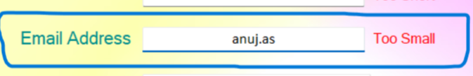
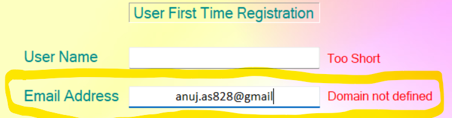
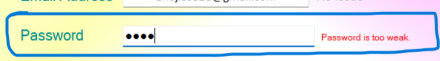
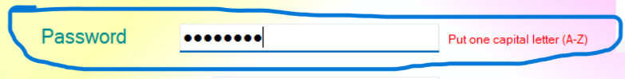
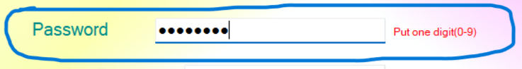
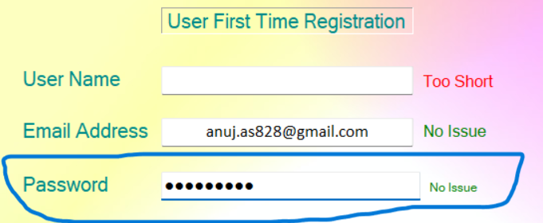

# AccountAnalyzer on Windows
### This is a windows API which analyzes whether the information like Name, email id, password etc. is in correct format or not.

#### To use this API insert the following <a href="https://drive.google.com/file/d/1rPiSXuyCAOjtFSxpg1wkjtnH7o6udCAG/view?usp=share_link"> Account Analyzer </a> .dll(Dynamic Link Library) file into the project

#### Here are some samples:

##### Analyzing Email : 
###### Too small

###### @ missing

###### Domain undefined

###### Correct email address

##### Analyzing Password : 
###### Too weak password

###### Atleast one capital letter

###### Atleast one digit

###### Correct password

